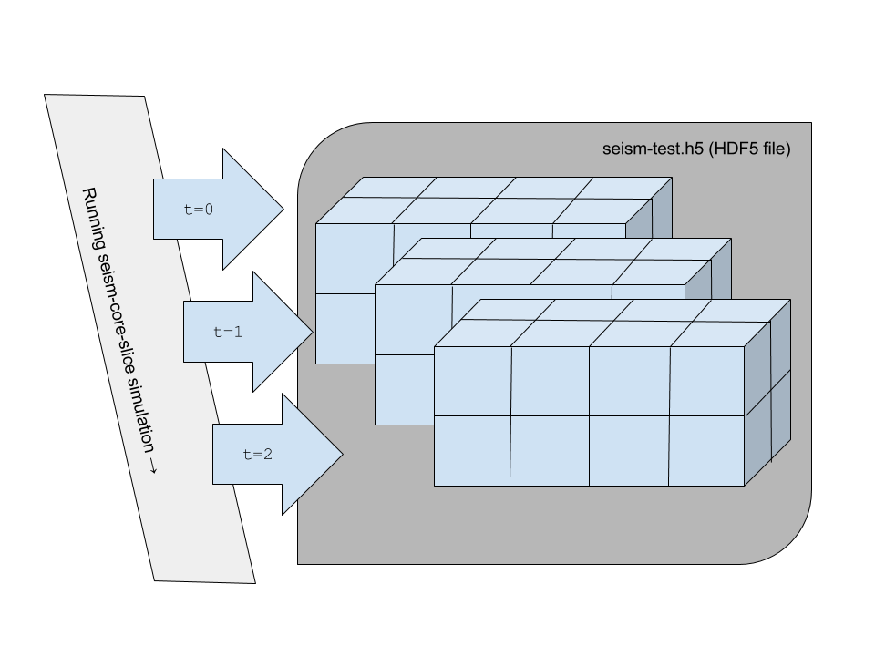

# SEISM-CORE I/O KERNEL FOR MEASURING THROUGHPUT 

---
---

## ABOUT

SEISM-CORE is a minimal kernel used for measuring the write throughput experienced by a typical parallel application writing checkpoints to an HDF5 file. A list of tuning parameters and code snippets showing their implementation is shown in PROGRAM INPUTS section.

Consecutive three-dimensional slices of a four-dimensional dataset are written for an increasing timestep index. The slices represent simulation data, being checkpointed after each simulation timestep. 

---

## BUILDING

It is assumed that the user has HDF5 installed on their system and wields basic knowledge for the compilation and linking of an HDF5-capable code on their platform. Sample Makefiles are provided in the directory 'makefiles', for the following systems:

* Makefile.bw-1.10.0 for NCSA Blue Waters, using HDF5 version 1.10.0
* Makefile.jelly for a large shared-memory CentOS system used internally at The HDF Group
* Makefile.vm for a cluster of VirtualBox vms with Ubuntu, used for testing

To build and install on a different system, select the most similar architecture and modify as needed.  In either case, running:

    $ cd src
    $ make -f ../makefiles/Makefile.whichever_architecture check-slice

will cause the kernel program and its corresponding test program to be built, run, and output checked based on the input file `tests/check.in`. 

---

## RUNNING AN EXAMPLE

Example inputs can either be entered interactively, fed as standard input, or as a heredoc in a script. Each input is read as a single line, in no specific order, until the token `DONE` is read, at which point the program will run, ignoring additional input (if any). Lines beginning with hash '#' character are ignored. For example, to enter as standard input, use the MPI launcher (mpiexec, mpirun, ibrun, aprun, etc.) appropriate to your system:

    $ mpiexec -n 8 ./seism-core-slice 

Then enter the seism-core commands:

    # default test set
    processor 2 2 2
    chunk 180 128 128
    domain 360 128 128
    time 5
    precreate
    collective_write
    set_collective_metadata
    never_fill
    DONE

As soon is `DONE` is read, the program stops receiving input and runs. The above input is used when running `make check-slice` in the section BUILDING.

---

##  PROGRAM INPUTS

### processor

*processor* is followed by an 'x y z' tuple, e.g. `5 4 2` which describes how the three-dimensional physical domain is mapped to a grid of processors, as shown in the figure. `5 4 2` results in 40 total processors being used. 

### chunk

*chunk* is followed by an 'x y z' tuple, e.g. `6 2 3` as illustrated by the colored blocks in the figure. Chunk describes the size and dimensions of data chunks stored in the chunked dataset. 

### domain

*domain* is followed by a tuple, e.g. `4 4 4` as shown in the figure, describing the extents of each block of domain (number of elements in each direction) to be handled by a single processor. Domain is independent of chunk size, although it would typically be equal to chunk size or larger.  

How chunks and domains map to one another is highly configurable.  To simplify, set chunk size equal to domain size. Note that domain and chunk sizes specified here are very small for purposes of illustration. Typical dimensions might be hundreds or thousands of elements. The mapping of chunks to processors for purposes of I/O is a separate matter, handled internally by the HDF5 library. 

### time

Number of time steps to be simulated. 

### precreate

Specifying *precreate* will cause the file and dataset to be created serially, and all chunks to be allocated on process 0. The file is opened, dataset created, resources allocated, and the file is closed on *process 0* only. The file is then re-opened by all processes for writing.
        assert(H5Pset_all_coll_metadata_ops(dapl, true) >=0 ); 

### collective_write

Specifying *collective_write* will cause hints to be passed to the underlying MPI implementation that the writing of data should be co-ordinated by the underlying MPI, i.e. collectively. 

    // Implementation in C 
    dxpl = H5Pcreate(H5P_DATASET_XFER);
    assert(H5Pset_dxpl_mpio(dxpl, H5FD_MPIO_COLLECTIVE) >= 0);
    assert(H5Dwrite(dset_chunked, H5T_NATIVE_FLOAT, mspace, fspace, dxpl, &v[0]) >= 0);

### set_collective_metadata

Specifying *set_collective_metadata* will cause HDF5 to attempt to perform metadata reads collectively. It can be set as a file access property, in which case it will be inherited by datasets opened in that file, or it can be set explicitly for only the dataset. 

    // Implementation in C
    if ((H5_VERS_MAJOR == 1) && (H5_VERS_MINOR >= 10) && set_collective_metadata)
    {
        // set collective metadata for file, will be inherited by any objects opened using this handle.
        assert(H5Pset_all_coll_metadata_ops(fapl, true) >=0 ); 
        // set collective metadata for dataset only.
        assert(H5Pset_all_coll_metadata_ops(dapl, true) >=0 ); 
    }

To verify whether metadata reads were in fact performed collectively:

    // Implementation in C
    hbool_t actual_metadata_ops_collective;
    H5Pget_all_coll_metadata_ops( dapl, &actual_metadata_ops_collective );

### never_fill

Specify this to keep HDF5 from explicitly writing a fill value. The filesystem will typically have its own mechanism of ensuring you are not receiving 'reclaimed data' from the last user of the disk space. The kernel operates on the assumption that a program will be writing unique data from each process, and ignores whatever is there initially. See the reference manual if you would like to set a fill value explicitly. 

    // Implementation in C
    if (never_fill) assert(H5Pset_fill_time(dcpl, H5D_FILL_TIME_NEVER ) >= 0);

## Dynamically loadable fill plugins

By default, seism-core-slice will cast the MPI rank of the owning process to a float and set all values in its data buffer equal to this value. Specifying the following commands in the script will allow a user-defined set of contextual fill values to be specified via a dlopen() call. The reference implementation gives two examples:  The first is to write the same fill value (MPI rank) as is done without using a plugin. The second example writes the value of a 3D scaled Gaussian which, except for intrinsic symmetry of the function, is uniquely valued over the entire simulation domain. To use this feature: 

* write a function with signature:
    your_function_name(int mpi_rank, hsize_t* system_size, hsize_t* domain_block_size, hsize_t* domain_block_number, hsize_t* position_in_block, int argc, char **argv);
* compile to object file as -fPIC (or however your compiler and platform mandate)
* bundle object into shared library .so (or however your compiler and platform mandate)
* make the library discoverable by placing it in your LD_LIBRARY_PATH

### use_function_lib libplugins.so

This option specifies the name of the library containing the function, e.g. libplugins.so in the reference implementation.

### use_function_name gaussian

Specify the name of the function within the library, e.g. gaussian(...) in the reference implementation.  

### use_function_argc 4

This tells the handler how many additional arguments to pass to the plugin (in addition to mpi rank, and location information, which are passed automatically). 

### use_function_argv 1 1 1 1 

Specify the values of these additional arguments. For flexibility, these values are passed as string arguments, analogously to the C standard. However, unlike the C standard argv[], user arguments are numbered beginning from zero. 

---

## INTERPRETING OUTPUTS

After the `DONE` token is read, the program echoes back the parameters used:

    ================================================================================
    Number of processes:            8
    Process layout:                 2 x 2 x 2
    Per process grid:               180 x 128 x 128
    Chunk dimensions:               360 x 128 x 128
    Number of time steps:           5
    Pre-create:                     1
    Collective I/O:                 1
    Collective metadata requested:  1
    Early allocation:               1
    H5D_FILL_TIME_NEVER set:        1

Then after writing the test data, the kernel reports the timings, throughput, and status of metadata operations:

    Pre-create/open:                0.0128601 s
    Time in precreate_0():          0.005651 s
    Time in H5Fopen():              0.00675511 s
    Time in H5Dopen():              0.000452042 s
    Write:                          1.11868 s
    Write throughput:               402.258 MB/s
    Close file:                     0.034353 s
    Aggregate throughput:           378.734 MB/s
    Mdata ops actually collective:  1

The Write throughput is the raw speed, not taking into account the overhead of opening/closing the file, creating the dataset, etc. Aggregate throughput takes these additional timings into account. In addition to the parameters named explicitly to the kernel, timings may vary widely based on factors such as: 

* system load
* stripe count (on LUSTRE filesystems)

To obtain reliable results, it's advised to repeat runs under varied system conditions and stripe counts.

